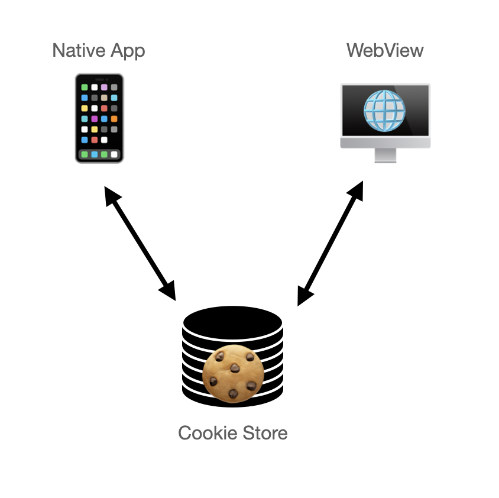
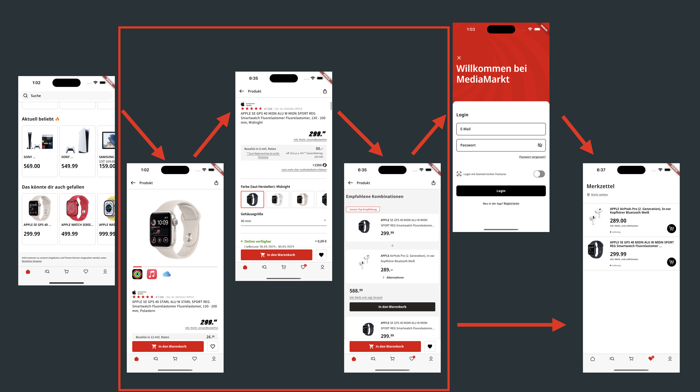
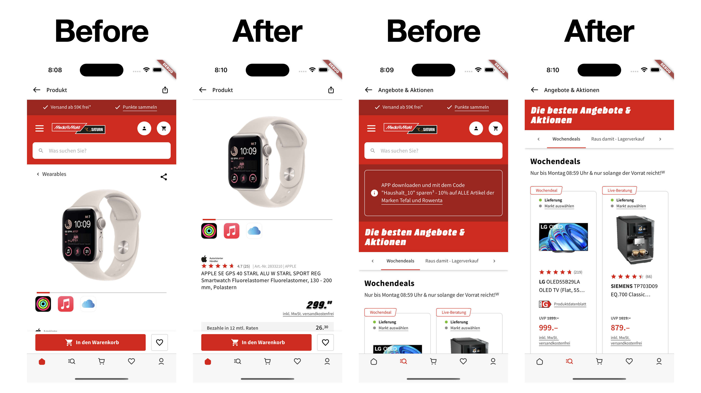
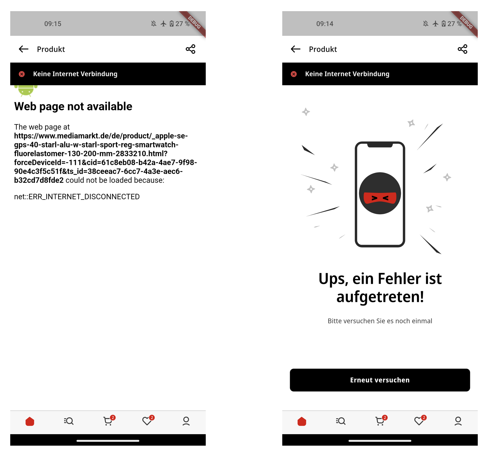

Originally published [here](https://medium.com/mediamarktsaturn-tech-blog/how-to-use-webviews-to-get-up-and-running-fast-d3599c884c2c) for the MediaMarktSaturn Tech Blog.

**_by [Jonas Uekötter](https://twitter.com/ue_man)_**


_We're using WebViews in the mobile apps for Media Markt and Saturn. I know, they're frowned upon, since they're bad for the performance, bad for the user experience and as mobile developers we want to build beautiful native experiences. But trust me, they're useful. Just keep reading._

---

Here at MediaMarktSaturn we have a much bigger team behind the web page than in the mobile team, [but we're trying to change that](https://careers.mediamarktsaturn.com/MediaMarktSaturn/?keyword=Flutter). A bigger web team means that a feature is typically in production on the web page before it's available on the app. By using WebViews in the app we can take advantage of the bigger web team and have the feature in the app basically at the same time as the web team.

As stated above in the introduction, we know that WebViews have their disadvantages.
Nevertheless, they have advantages as well which make them worthwhile to use, and this blog post is about that.

> A short technical note: The code snippets in this blog post assume, that you're at least somewhat familiar with Dart and Flutter. They're also assuming that `flutter_inappwebview` in version 5.7.2 was added as dependency to the `pubspec.yaml` file.

## MVPs and WebViews

I'm going to assume that you're already familiar with the concept of an [MVP](https://en.wikipedia.org/wiki/Minimum_viable_product), but the gist of is, that we start with a reduced scope for a feature in order to penetrate the market faster. After it's rolled out, it gets iterated and more useful with each iteration. Here's where the WebView comes into play: By showing the WebView in the app, we can start with the fully working feature, albeit not as a native feature.

While the customer can already enjoy the feature in the WebView, we can measure whether that newly introduced feature is actually used in the app and whether it satisfies our customers (well, and of course our) expectations. If that’s the case, we start working on building the native feature. When we achieved parity, or an acceptable alternative we switch from the web to the native implementation.

## WebViews are a safety net

Next to the MVP aspect, WebViews have another pretty great advantage. While we roll out the native replacement for the web implementation, we also have to monitor whether anything breaks in the native part. If we notice, there's a bug which impacts the user experience, we need to fix it. As you might know, rolling out hot fixes isn’t exactly fast in the mobile ecosystem. It first has to pass the stores review processes and then the customer has to download the update, but he can also choose not to.

So what are we going to do? We keep the feature in the WebView and introduce the native replacement by making it switchable via feature flag. That way we can switch between the native implementation and the WebView in case something is buggy in the native implementation.
Keeping the feature in the WebView around is thereby a pretty awesome safety net.

After telling you why WebViews are awesome, I also have to explain what problems we need to tackle to make it a viable solution.

## Syncing state between web and app

One of the biggest issue with this app and web hybrid approach is to sync state between the content in the WebView and native parts of the app. I'm going to use the authentication state of the user as an example here. The authentication state of the customer is saved in a cookie, which means we have to synchronise the cookies between the app and the WebView. How are we going to do that?

The WebViews from Android and iOS provide us developers with APIs for the so called cookie store (often jokingly referred to as cookie jar), which drives the respective platforms WebView. We’re using that cookie store not just to drive the WebView, but also to drive the whole web traffic for all native parts of the application.



So what does this mean in practice? We have a native login in which we write the cookies the server responds with to the cookie store.
When the customer is opening a WebView, the WebView reads the cookie store and sends the previously set cookies when making a request. Based on the cookies, the server knows the users login.

With that out of the way, we solved a big problem of a hybrid application.

## Hybrid navigation

The next big problem is the hybrid navigation flow, in which we have a navigation flow between native and WebView parts. In order to present our customers with a great experience we need to enable a seamless navigation between the two parts. Consider the following image. The screens in the red square are webviews, and the rest of the screens are native.



Solving this problem for the forward navigation is doable as the WebView provides callbacks which let us know whenever it wants to open a new URL.

That means we need to establish a mapping between URL and native feature. Since we already need this anyway for deeplinking, this is an already solved problem.

So we basically just check whether the URL the WebView wants to navigate to should be opened in the WebView or as a native component. This is demonstrated in the code snippet below. In case the URL to be opened corresponds to a native feature we cancel the in WebView navigation and reroute the customer to the native feature. In the other case, we allow the WebView to go on with opening the requested web page.

```dart
final nativeFeatureUrl = Uri.parse('...');

InAppWebView(
  shouldOverrideUrlLoading: (controller, navigationAction) {
    if(navigation.request.url == nativeFeatureUrl) {
      Navigator.of(context).pushRoute(...);
      return NavigationActionPolicy.CANCEL;
    }
    return NavigationActionPolicy.ALLOW;
  },
)
```

After dealing with the forward navigation, we also have to deal with the backwards navigation.
For the backward navigation we ask the WebView whether there are still entries on the WebView's navigation stack, and if so, we request the WebView to pop the topmost web page. Rinse and repeat until the WebView's stack is empty. When that stack is empty, we close the WebView and navigate back in the app.

Now, that we’ve solved the two main problems to make WebViews a viable solution, we turn our head to optimize the user experience. I’m going to present you a couple of examples that we’ve implemented in the Media Markt and Saturn apps. These optimizations require a good communication and cooperation between the app and the web team as the web team is the enabler for those optimizations. Another helpful approach is to have an inner source model, so that the app team can do those changes themselves on the web page.

## Removing footers and headers



The improvement with the biggest positive impact on the user experience is to simply remove the header and footer of the shown webpage. Without header and footer the content in the webpage just looks way more integrated and, dare I say it, native. We can even enrich the screen where the webpage is shown with native content provided by the app. See for example the share button on the product detail page which makes the experience another tad more pleasant.

Further improvements could be to hide the “Add to Basket” button in the webpage and replace it with a native one. Same for the "Add to Wishlist" button.

## Bridge calls for delightful hybrid interactions

Another improvement is to implement so called JS bridge calls. Bridge calls make it possible to communicate between the webpage and the app. In the example seen {above&#124;below}, we open the native club card bottom sheet after clicking on the link in the webpage. The club card can be used to collect rewards by the way, to make sure to upgrade your MediaMarkt account to become a club member. Showing the native club card bottom sheet allows us to have a more integrated experience for adding the card to Google and Apple wallet depending on the platform.

Another use case, where we're using it, is to get notified when a customer adds a product to their basket or their wishlist. After getting notified we can update the badges on the bottom navigation bar to indicate how many products are put in.

## Native error pages



The last example of improvements is the error page during no-internet situations. By default Android shows the ugly error indicator page on the left side, as seen in the example above. I think we can all agree, that we rather have the error indicator page on the right side, right? Okay, then lets do it. We enable this by listening for error callbacks from the WebView and in the case of one, we hide the WebView to show a native error page with a button to reload the page. It looks somewhat like the below example.

```dart
const _iosErrorCodes = { -1004, -1009, ... };
const _androidErrorCodes = { -2, -6, -8, -12, ...};

bool error = false;

// In the widgets build method
if (error) {
  return ErrorWidget();
}

return InAppWebView(
  onLoadError: (controller, url, code, message) {
    if(Platform.isAndroid && _androidErrorCodes.contains(code)) {
      setState(() => error = true);
    } else (_iosErrorCodes.contains(code)) {
      setState(() => error = true);
    }
  },
);
```

Since we've now enabled and improved WebViews to be great, we surely want to use our newly found power for everything, right? No, there are some things we shouldn't do with WebViews.

## Things you shouldn't do with WebViews

It starts with payment processors, since they really don't like being shown in a WebView. They discourage or even straight out prohibit it. So please make sure to check with your payment processor, to see whether they are okay with it.

Another thing you shouldn't do is showing third party websites in your WebView, or [even inject tracking code like TikTok, Facebook and Instagram famously do](https://krausefx.com/blog/ios-privacy-instagram-and-facebook-can-track-anything-you-do-on-any-website-in-their-in-app-browser).

Instead payment processors and third party websites should be shown in [Chrome Custom Tabs](https://developer.chrome.com/docs/android/custom-tabs/) or a third party browser instead.
Chrome Custom Tabs or the Safari equivalent on iOS are the preferred solution, since they're more tightly integrated than an external browser while not being a WebView. That means they're not completely guiding the user out of the app, but instead make it easy for them to stay in the app.

## Recap

That's it! In this blog post you've learned that WebViews have a lot of advantages which make them a very viable starting point for a lot of features, which hurdles you have to solve to make them work and how to improve the experience when using them. Finally, you've also learned when not to use them.
If you want to join our journey to make the WebViews a thing of the past, [we're hiring](https://careers.mediamarktsaturn.com/MediaMarktSaturn/?keyword=Flutter).

**_get to know us 👉 [https://mms.tech](https://mms.tech) 👈_**
